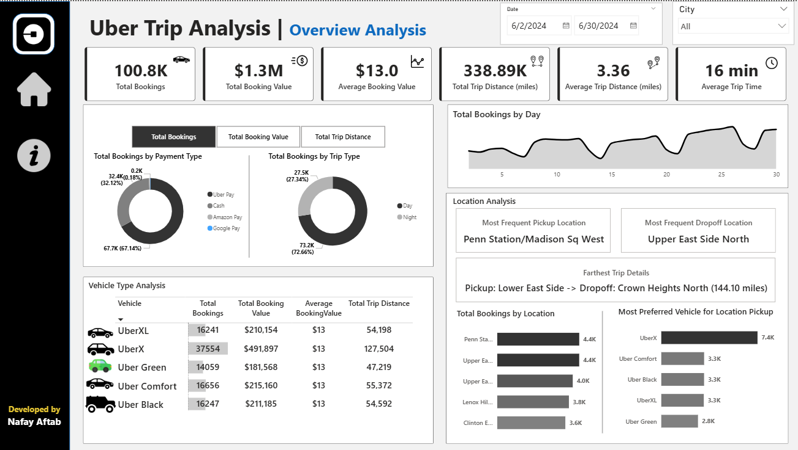

# 🚕 Trip Analysis Dashboard (Power BI)

This repository contains a **single-page Power BI dashboard** built to analyze trip data. The dashboard provides a consolidated view of key business metrics, including booking trends, revenue, and detailed location-based insights.

---

## 📸 Dashboard Preview

> Make sure the screenshot image is added to your GitHub repo (example file: `dashboard.png`)

---

## 1. Project Overview

The goal of this project is to transform raw trip data into an **interactive, business-ready dashboard**.  
Stakeholders can use this report to:

- Monitor overall performance  
- Identify peak demand periods  
- Analyze revenue streams  
- Discover location-based trends to optimize driver distribution and pricing strategies  

---

## 2. Data Sources

The report is built using two primary CSV files:

| File Name | Description |
|-----------|-------------|
| **Trip Details.csv** | Fact table containing every trip record (timestamps, fare, distance, pickup/dropoff IDs, etc.) |
| **Location Table.csv** | Dimension table mapping `LocationID` to readable location names and cities |

✅ Table names **do not include the word “Uber”** inside Power BI.

---

## 3. Key Features & Visuals

The dashboard is designed for both **high-level monitoring** and **deep-dive analysis**, all on a single page.

### 💳 KPI Banner (Top Section)

| KPI | Description |
|-----|-------------|
| **Total Bookings** | Number of completed trips |
| **Total Booking Value** | Sum of all fare revenue |
| **Average Booking Value** | Average revenue per trip |
| **Total Trip Distance** | Total miles traveled |
| **Average Trip Distance** | Average miles per trip |
| **Average Trip Time** | Average duration per trip |
| **Most Frequent Pickup** | Most common pickup location |
| **Farthest Trip Details** | Full text description of the longest recorded trip |

---

### 🎚️ Interactive Slicers

| Slicer | Purpose |
|--------|---------|
| **Date Range** | Filter entire report by time period |
| **City** | Filter by pickup city |
| **Measure Selector** | Switch visuals between: Total Bookings / Total Booking Value / Total Trip Distance |

---

### 📊 Dashboard Visuals

#### 🔄 Dynamic Charts (Left Panel)
Driven by the **Measure Selector**:

- **By Payment Type (Bar Chart)** – Compare selected metric by payment mode  
- **By Trip Type (Donut Chart)** – Day vs Night trip analysis (Day = 6 AM–6 PM)

#### 📍 Location Analysis (Right Panel)

- **Top 5 Pickup Locations (Bar Chart)**  
- **Most Preferred Vehicle by Location (Stacked Bar Chart)** – Shows vehicle type usage for busiest pickup points  

---

### ✨ UX Enhancements

| Feature | Description |
|---------|-------------|
| **Clear Filters Button** | One-click reset for all slicers |
| **Data Details Pop-up** | Bookmark-based info panel explaining metrics & visuals |

---

## 4. Technical Implementation

### 📐 Data Model
Star schema structure:

- Active relationship: `PULocationID` → `LocationID`
- Inactive relationship: `DOLocationID` → `LocationID` (activated using `USERELATIONSHIP()` in DAX)

### 🔧 Power Query Transformations

| Column | Logic |
|--------|-------|
| **Trip Time (Minutes)** | Dropoff Time − Pickup Time |
| **Trip Type** | "Day" or "Night" based on pickup hour |
| **Hour, Day Name, Day of Week** | Extracted from pickup timestamp |

### 🧠 DAX Measures

| Type | Examples |
|------|----------|
| **Base Measures** | `Total Bookings`, `Total Booking Value`, `Total Trip Distance` |
| **Dynamic Measure** | `[Selected Measure]` using `SWITCH()` + `SELECTEDVALUE()` |
| **Dropoff Metrics** | `CALCULATE()` + `USERELATIONSHIP()` |
| **Farthest Trip Text** | Uses `MAX()`, `FILTER()`, `LOOKUPVALUE()`, `CONCATENATE()` to return readable trip details |

---

## 5. How to Use

1. Download the `.pbix` file.  
2. Open it in **Power BI Desktop**.  
3. Ensure the CSV files are available and refresh the model.  
4. Use slicers to explore the data interactively.  
5. Click the **“Data Details”** icon for a built-in guide to visuals & metrics.

---

✅ **Fully interactive, business-ready Power BI dashboard**  
🎯 Perfect for portfolio, analytics demo, or real-world reporting use cases.

Star schema structure:

